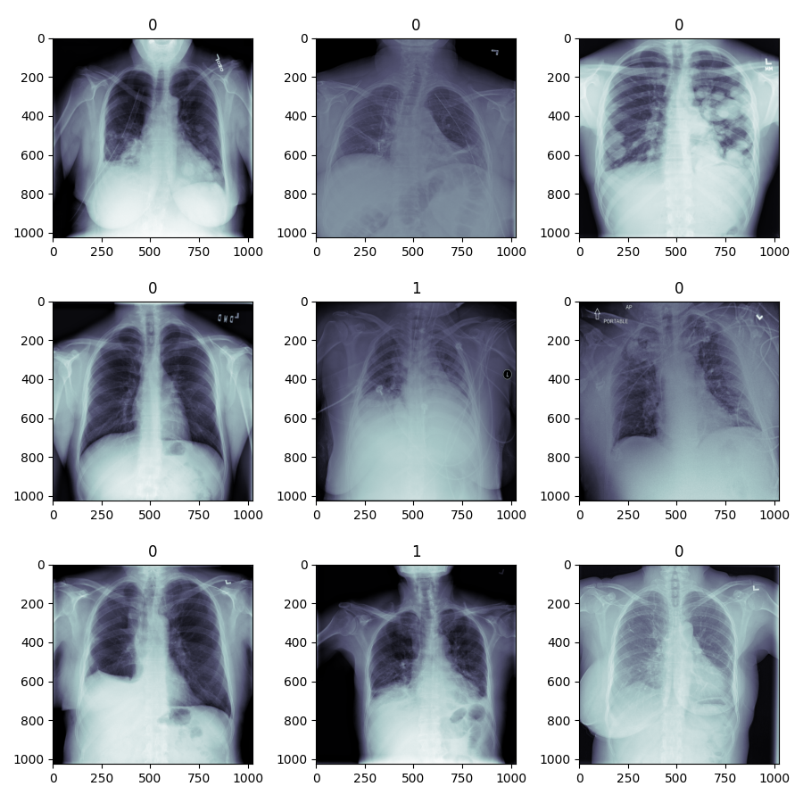
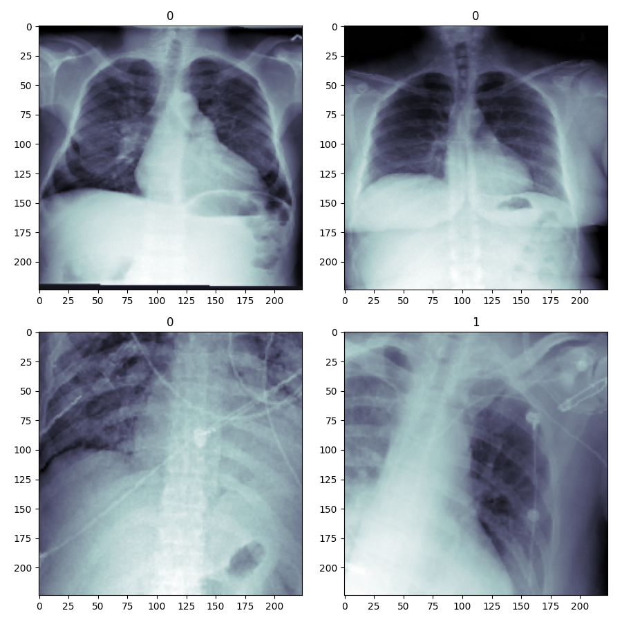
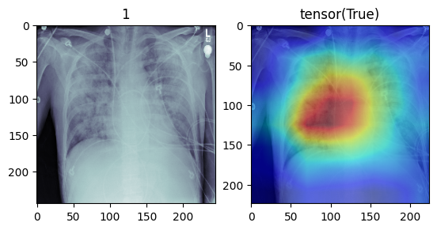

## Introduction
In this project we will preprocess the data for the pneumonia detection task. Then, we will load and return an X-Ray image for transformation and prediction.

At first we download the data from [kaggle](https://www.kaggle.com/c/rsna-pneumonia-detection-challenge/data)

```bash
# Install the kaggle library
pip install kaggle

# Accept the competition rules and configure the path of kaggle.json file
mkdir -p ~/.kaggle
cp kaggle.json ~/.kaggle/
chmod 600 ~/.kaggle/kaggle.json

# Download the dataset from kaggle
kaggle competitions download -c rsna-pneumonia-detection-challenge
```

Dataset:
Wang X, Peng Y, Lu L, Lu Z, Bagheri M, Summers RM. ChestX-ray8: Hospital-scale Chest X-ray Database and Benchmarks on Weakly-Supervised Classification and Localization of Common Thorax Diseases. IEEE CVPR 2017, http://openaccess.thecvf.com/content_cvpr_2017/papers/Wang_ChestX-ray8_Hospital-Scale_Chest_CVPR_2017_paper.pdf

Some example images from dataset :<br/> 

We will again convert the images to npy files for efficient storage and faster data loading.

In order to efficiently handle our data in the Dataloader, we convert the X-Ray images stored in the DICOM format to numpy arrays. Afterwards we compute the overall mean and standard deviation of the pixels of the whole dataset, for the purpose of normalization.
We standardize all images by the maximum pixel value in the provided dataset, 255.
All images are resized to 224x224.
To compute dataset mean and standard deviation, we compute the sum of the pixel values as well as the sum of the squared pixel values for each subject.
This allows to compute the overall mean and standard deviation without keeping the whole dataset in memory.

## Network architecture: Resnet18
As most of the torchvision models, the original ResNet expects a three channel input in **conv1**. <br />
However, our X-Ray image data has only one channel.
Thus we need to change the in_channel parameter from 3 to 1.

1 output: We need to estimate whether the X-ray image shows signs of pneumonia or not.

Loss function: We are going to use the Weighted `BCEWithLogitsLoss (with pos_weight=torch.tensor([3])`, as we are dealing with a class imbalance within the dataset.

The second approach taken is to `undersample` the majority class to match the frequency of the minority class and train the model with this new balanced dataset and `BCEWithLogitsLoss` without any class weights.

After applying data augmentation and normalization: <br/> 

## Final result
| **Computed Metrics** | *Accuracy* | *Precision* | *Recall* | *F1 Score* |
| --- | --- | --- | --- | --- |
| **Weighted Loss** | 0.776654 | 0.502599	| 0.804493 | 0.618682
| **Undersampling** | 0.773389	| 0.798908 | 0.730449	| 0.763147

## CAM Visualization

